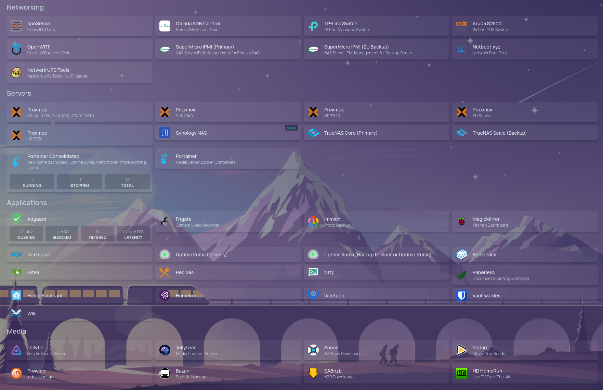

### Hi there 👋

I'm Robbie!

- 🔭 My background is in Electrical Engineering with a specilization in communcations system. I have a passion for security & strive to develop a deep understanding of any technology I work with.
- 🌱 I’m a lifelong learner working on improving my programming skills in Python, C, and C++
- 💬 Ask me about selfhosting! I run a 5 node high-availability Proxmox cluster which houses all of my self-hosted applications. Check out my network diagram on my [website](https://litts.me/homelab)

Here's what I am running at home:

Thanks for stopping by! 
